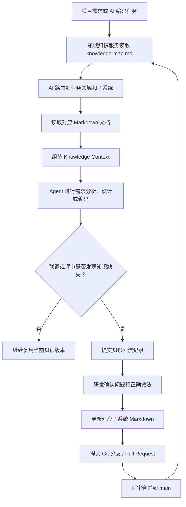

# 定制领域知识库

本仓库用于维护公司项目定制研发场景中的领域知识，供领域知识服务系统、AI 编程 Agent、需求分析 Agent、产品设计 Agent 和架构设计 Agent 读取。

它不是普通问答知识库，也不是代码仓库。它的核心目标是：把公司业务领域知识沉淀为稳定的 Markdown 文档，并通过 `knowledge-map.md` 帮助 AI 根据用户需求自动路由到正确的业务领域和知识文档。

## 仓库定位

当研发或 Agent 输入类似下面的需求时：

```text
我要做一个访客预约审批，扫码入园，离园自动核销功能
```

领域知识服务系统会读取当前 Git 版本下的：

1. `knowledge-map.md`
2. 对应业务子系统目录下的 Markdown 文档

然后组装成可供 Agent 使用的 `Knowledge Context`。

## 核心原则

```text
Git 管知识版本
knowledge-map.md 管 AI 路由
Markdown 管领域知识
领域知识服务系统管读取、路由和组装
研发团队负责评审、补充和回流
```

知识内容必须进入 Git 版本管理。每次 Agent 使用知识时，`knowledge-map.md` 和业务文档必须来自同一个 branch、tag 或 commit，避免路由和文档版本不一致。

## 目录结构

推荐目录结构如下：

```text
domain-knowledge/
├── README.md
├── knowledge-map.md
│
├── 企业业务/
│   ├── 智慧园区/
│   │   ├── 访客子系统/
│   │   │   ├── 业务概述.md
│   │   │   ├── 业务流程.md
│   │   │   ├── 领域概念.md
│   │   │   ├── 业务规则.md
│   │   │   ├── 数据模型.md
│   │   │   ├── 接口设计.md
│   │   │   ├── 页面设计.md
│   │   │   ├── 开发约束.md
│   │   │   ├── 常见定制场景.md
│   │   │   └── 踩坑经验记录.md
│   │   │
│   │   └── 门禁子系统/
│   │       ├── 业务概述.md
│   │       ├── 业务规则.md
│   │       ├── 接口设计.md
│   │       └── 踩坑经验记录.md
│   │
│   ├── 能源/
│   ├── 教育/
│   ├── 文教卫/
│   └── 医疗/
│
└── 政府业务/
    ├── 公安/
    ├── 交警/
    ├── 司法/
    ├── 政务服务/
    └── 应急指挥/
```

## knowledge-map.md 如何管理

`knowledge-map.md` 是 AI 路由文档，不是普通目录说明。

它负责告诉大模型：

- 公司有哪些业务领域
- 每个行业线有哪些子系统
- 每个子系统的业务能力是什么
- 客户通常会怎样表达这些需求
- 命中某类需求后应该读取哪些 Markdown 文档

建议保持以下结构：

```text
第一部分：公司业务领域总述
第二部分：领域目录树
第三部分：子系统业务索引表
第四部分：AI 路由规则
第五部分：输出 JSON 格式要求
```

其中“子系统业务索引表”最重要，建议包含：

| 字段 | 说明 |
|---|---|
| 业务领域 | 如企业业务、政府业务 |
| 行业线 | 如智慧园区、公安、能源 |
| 子系统 | 必须写完整目录路径 |
| 业务能力描述 | 用业务语言说明子系统能做什么 |
| 客户常见表达 | 记录客户不标准但常见的说法 |
| 业务关键词 | 用于辅助路由 |
| 涉及知识文档 | 命中后建议读取的 Markdown |

新增、移动或删除子系统目录时，必须同步更新 `knowledge-map.md`。

## 子系统文档如何管理

每个子系统建议固定维护以下文档：

| 文档 | 用途 |
|---|---|
| 业务概述.md | 说明业务边界、目标和适用场景 |
| 业务流程.md | 说明业务流转过程 |
| 领域概念.md | 说明业务名词、对象关系和状态含义 |
| 业务规则.md | 说明限制、校验、异常和状态流转 |
| 数据模型.md | 说明表、字段、对象和关联关系 |
| 接口设计.md | 说明接口入参、出参和调用顺序 |
| 页面设计.md | 说明页面结构、字段和交互 |
| 开发约束.md | 说明公司架构、代码规范和技术约束 |
| 常见定制场景.md | 说明客户定制中常见变化 |
| 踩坑经验记录.md | 记录 AI 或研发历史上容易犯错的点 |

不要求每个子系统一开始就全部补齐，但 `业务规则.md`、`接口设计.md`、`开发约束.md`、`踩坑经验记录.md` 对编码场景非常关键，建议优先维护。

## 知识回流机制

知识回流是本仓库最重要的长期价值来源。

当 AI 编码、研发联调或项目交付中发现知识缺失、规则误判、接口误用、状态流转错误时，应将经验回流到对应子系统的 Markdown 文档中，尤其是 `踩坑经验记录.md`。

### 回流内容建议

`踩坑经验记录.md` 建议按以下结构记录：

```md
## PIT-001：问题标题

### 问题描述

说明 AI 或研发容易出错的场景。

### 错误实现

- 错误做法 1
- 错误做法 2

### 正确实现

- 正确做法 1
- 正确做法 2

### 影响范围

- 后端接口
- 前端展示
- 数据模型
- 第三方联动

### 关联文档

- 业务规则.md
- 接口设计.md
```

## 维护流程



## Git 分支与版本建议

建议使用以下分支策略：

| 类型 | 示例 | 用途 |
|---|---|---|
| main | `main` | 稳定知识版本，供默认环境使用 |
| 项目分支 | `project/智慧园区一期` | 项目定制知识沉淀 |
| 修订分支 | `feedback/visitor-qrcode-rule` | 知识回流、踩坑修订 |
| tag | `kb-v2026.06.21` | 固化某个可复现知识版本 |

领域知识服务调用时可以指定：

```json
{
  "knowledge_ref": "main"
}
```

也可以指定项目分支、tag 或 commit，确保 Agent 使用可追溯的知识版本。

## 提交规范

建议提交信息使用以下格式：

```text
docs(visitor): add QR code approval rule pitfall
docs(access): update gate event callback contract
map: add smart park vehicle subsystem route
```

常见前缀：

| 前缀 | 说明 |
|---|---|
| `map` | 修改 `knowledge-map.md` |
| `docs(subsystem)` | 修改某个子系统知识文档 |
| `feedback(subsystem)` | 回流踩坑经验 |
| `refactor` | 调整目录或文档结构 |

## 编写要求

- 使用 Markdown。
- 文件名保持中文业务语义，方便研发搜索。
- 子系统路径必须稳定，避免随意改名。
- 业务规则要写明确，不要只写原则。
- 涉及状态、字段、接口、页面交互时，尽量表格化。
- 如果知识不确定，请标注“需要人工确认”。
- 不要把真实客户敏感信息、账号、密钥、个人隐私写入仓库。

## 当前已初始化内容

当前仓库已初始化：

- `knowledge-map.md`
- `企业业务/智慧园区/访客子系统`
- `企业业务/智慧园区/门禁子系统`
- `企业业务/智慧园区/基础管理子系统`
- `企业业务/智慧园区/车辆管理子系统`
- `企业业务/智慧园区/能耗管理子系统`
- `企业业务/智慧园区/安防监控子系统`
- `企业业务/能源`
- `企业业务/教育`
- `企业业务/文教卫`
- `企业业务/医疗`
- `政府业务/公安`
- `政府业务/交警`
- `政府业务/司法`
- `政府业务/政务服务`
- `政府业务/应急指挥`

后续可按相同结构继续补充各行业线下的具体子系统和标准知识文档。
